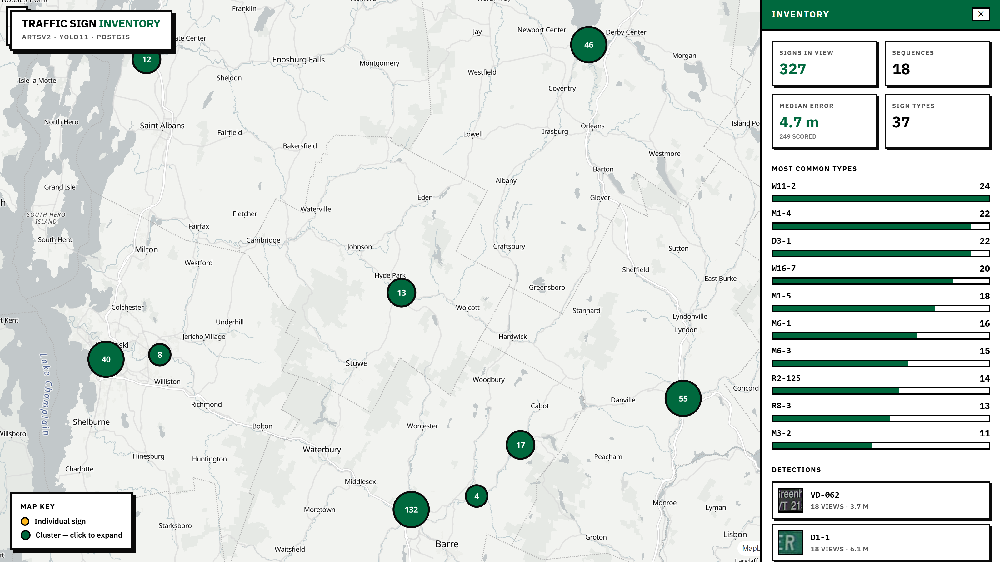
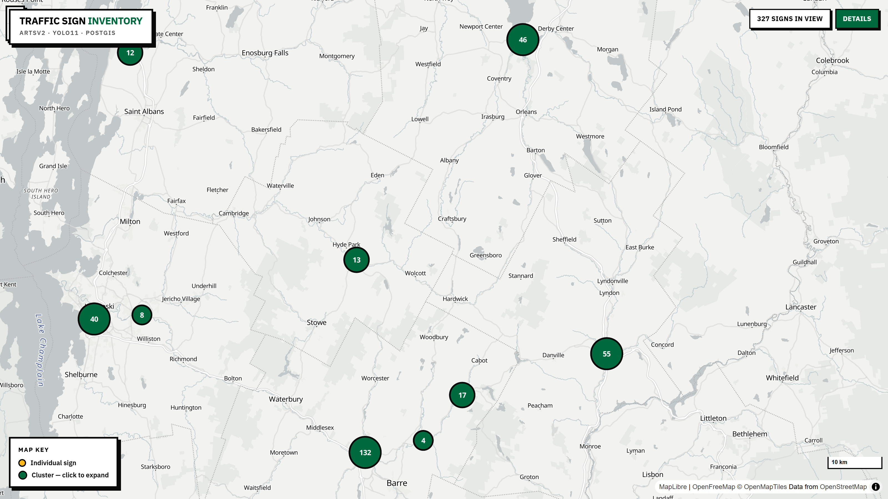
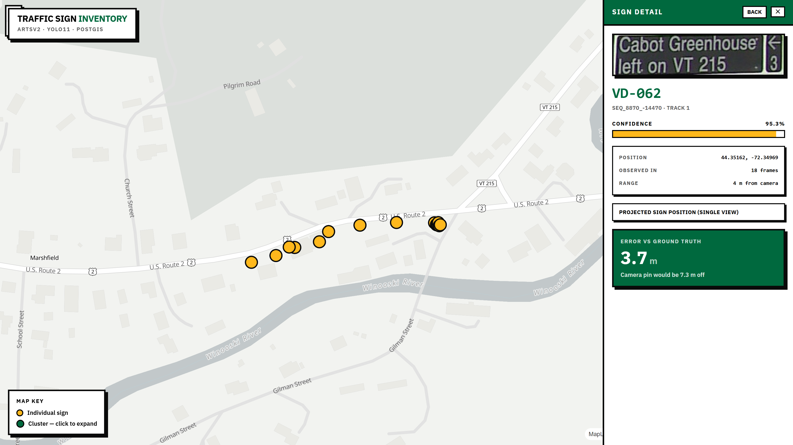
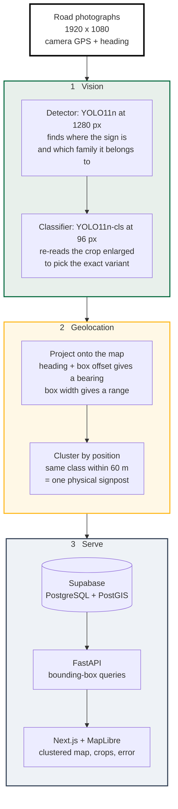

# Traffic Sign Inventory

Turn GPS-tagged road photographs into a searchable map database that aims for one row per physical signpost.



---

## Features

- **Detects road signs** in survey photographs and classifies them into 50 sign types, mostly Manual on Uniform Traffic Control Devices (MUTCD) codes plus a few Vermont catalog codes such as `VR-141` and `WT-100`.
- **Locates each sign**, not the camera. Median error is 4.7 m, against 10.7 m for the raw vehicle GPS.
- **Deduplicates automatically.** A sign photographed 13 times becomes one database row, not 13. The deduplication score on held-out roads is 67.9% (see [Results](#results)).
- **Two-stage classification.** A second model re-reads each crop from a look-alike sign family, lifting accuracy on those families from 78.7% to 94.3%.
- **Stores results in PostGIS**, so map queries like "every sign in this rectangle" run in the database.
- **Ships a dashboard** with a clustered map, per-sign crops, and the measured error wherever ground truth exists.
- **Reproducible from the shipped weights.** Four scripts rebuild the held-out data and regenerate the reported scores on a CPU, into tracked files under `results/` (see [Reproducing the results](#reproducing-the-results)).
- **Tested.** The geometry, clustering, classification and scoring code has unit tests that run without the dataset, on every push.

## Tech stack

| Layer | Choice |
|---|---|
| Detection | YOLO11n (Ultralytics 8.4.120), 1280 px |
| Classification | YOLO11n-cls, 96 px crops |
| Backend | FastAPI, Python 3.10+ (the notebooks ran on 3.12) |
| Database | Supabase — PostgreSQL + PostGIS |
| Frontend | Next.js 14, MapLibre GL, Tailwind CSS |
| Training | Google Colab, free T4 GPU |
| Dataset | ARTSv2 (University of Vermont), not redistributed here |

---

## Quick start

### Prerequisites

- Python 3.10 or newer (the notebooks ran on 3.12)
- Node.js 18 or newer
- A free [Supabase](https://supabase.com) project
- About 15 GB of free disk space for the dataset and its converted copy

Trained weights and the fitted camera constants are included in `weights/`, so no
training is needed. No GPU is needed either.

The commands below use bash syntax. In PowerShell, set a variable with
`$env:NAME="value"` before the command instead of `NAME=value` in front of it.

### 1. Install

```bash
python -m venv .venv
.venv/Scripts/python.exe -m pip install -r requirements.txt
npm install --prefix frontend
```

Use `.venv/bin/python` instead on macOS and Linux. Without a GPU, install the CPU
build of PyTorch first to save about 2 GB:

```bash
.venv/Scripts/python.exe -m pip install torch==2.11.0 torchvision --index-url https://download.pytorch.org/whl/cpu
```

### 2. Get the photographs

The dataset is not part of this repository and is not redistributed. Download
ARTSv2 from its authors (see [Dataset](#dataset)) and place the
`challenging_dom` folder at `data/arts_v2/`, so that it contains `Annotations/`,
`JPEGImages/` and `ImageSets/`. Then build the converted dataset and the road
sequences:

```bash
.venv/Scripts/python.exe scripts/02_convert_arts_to_yolo.py
.venv/Scripts/python.exe scripts/05_export_sequences.py
```

The converter writes `data/arts_yolo/` with the same geographic split, classes and
settings the shipped weights were trained on. The export writes the 30 held-out road
sequences to `data/sequences/`, a demo sequence to `data/demo_sequence/`, and
`results/split_manifest.csv`.

### 3. Create the database

1. Create a project at [supabase.com](https://supabase.com).
2. Open the SQL Editor and run [`scripts/04_seed_supabase.sql`](scripts/04_seed_supabase.sql).
   This creates the table, the PostGIS functions, and the row-level security
   policy. It is safe to run more than once.
3. Under **Storage**, create two public buckets: `sign-crops` and `sign-frames`.
   Cropped sign images and full frames are uploaded here.
4. Open **Project Settings → API** and copy three values:

   | Value | Where it appears | What it is for |
   |---|---|---|
   | Project URL | top of the page | the address of the database |
   | `service_role` key | under Project API keys | full access, used by the backend only |
   | `anon` key | under Project API keys | public read-only key for browser-side access; not read by the current code |

### 4. Configure

```bash
cp .env.example .env
```

Fill in the three values copied above:

```bash
SUPABASE_URL=https://your-project.supabase.co
SUPABASE_SERVICE_ROLE_KEY=eyJhbGciOi...
SUPABASE_ANON_KEY=eyJhbGciOi...
```

The `service_role` key bypasses row-level security, so it must stay on the
server and must never reach a browser. The `anon` key is the safe one to expose;
it is limited to reading by the policy created in step 3. No code reads it yet:
the dashboard gets its data through the backend.

Every other setting has a working default. See
[Configuration](#configuration) for the full list.

### 5. Verify

```bash
.venv/Scripts/python.exe scripts/00_preflight.py
```

Checks the Python packages, loads the detector (and confirms it is not the
80-class COCO model) and the crop classifier, reads the stored camera constants,
checks the photographs and the GPS, ground-truth and sign-id coverage of
`frames_meta.json` in `SEQUENCE_DIR`, then calls the live database to confirm the
table, the `signs_in_bbox` function, and both storage buckets. Prints `READY`, or
names exactly what is missing.

### 6. Run

Fill the map with the 18 held-out road sequences, scored as they go:

```bash
UPLOAD=1 .venv/Scripts/python.exe scripts/07_batch_evaluate.py
```

Or run the pipeline on any single folder of converted photographs:

```bash
.venv/Scripts/python.exe scripts/03_run_pipeline.py
```

Then start the two servers, each in its own terminal:

```bash
.venv/Scripts/python.exe -m uvicorn backend.main:app --port 8000
```

```bash
npm run dev --prefix frontend
```

Open **http://localhost:3000**.

---

## Screenshots



Green circles are clusters and split apart when clicked. Gold circles are
individual signs. The side panel summarises whatever is in view and lists
detections with their crops.



Selecting a sign shows its crop, class, confidence, and how many photographs it
came from. A `VD-062` guide sign ("Cabot Greenhouse, left on VT 215") on US
Route 2 in Marshfield, seen in 18 photographs and collapsed into one row, sits
**3.7 m from where it actually stands — against 7.3 m if the vehicle GPS were
used directly**.

Every coordinate carries its provenance. Computed positions are labelled
"Projected sign position (single view)"; placeholder coordinates appear as grey
pins with a red label, so demo data can never pass as a real detection.

---

## Results

Pipeline metrics are measured on 18 road sequences from the held-out test split:
646 photographs and 366 signposts. No signpost in this set appears in training.
The projection constants were fitted on 12 other test-split sequences (462
photographs), which are excluded from every number below. Detection mAP is
measured on the whole test split (2,502 photographs).

| Metric | Result | Regenerated by |
|---|---|---|
| Detection (whole test split) | mAP50 **0.723** · mAP50-95 **0.495** | `08_evaluate_models.py` |
| Crop classifier (2,173 validation crops) | top-1 **96.6%** | `08_evaluate_models.py` |
| Sign classification (detections matched to a labelled sign) | **94.8%** | `07_batch_evaluate.py` |
| Signposts found | **87.7%** (321 of 366) | `07_batch_evaluate.py` |
| Position error | **4.7 m** median · 17.2 m at p90 | `07_batch_evaluate.py` |
| Same, using raw vehicle GPS | 10.7 m | `07_batch_evaluate.py` |
| Improvement from projection | **56%** | `07_batch_evaluate.py` |
| Deduplication (defined below) | **67.9%** (49.5% without the crop classifier) | `07_batch_evaluate.py` |
| Strict one-to-one | 160 of 366 posts (43.7%) | `07_batch_evaluate.py` |
| Rows in the dashboard | 327, of which 249 match a labelled sign and are scored | `07_batch_evaluate.py` with `UPLOAD=1` |

Every number in this table was regenerated from the shipped weights with
[`notebooks/02_reproduce_on_colab.ipynb`](notebooks/02_reproduce_on_colab.ipynb)
(Colab T4, Ultralytics 8.4.120, PyTorch 2.11) and is stored in `results/`. The
detector, classifier, position and classification numbers match the original run
to the reported precision. Two changed, because the scoring was corrected to count
the signs inside rows whose widest view matched no labelled sign (they used to be
skipped): signposts found rose from 80.1% to 87.7%, and deduplication fell from
72.4% to 67.9% (52.7% to 49.5% without the crop classifier).

### Two-stage classification

Some sign families are visually identical apart from small text. `M3-1` to `M3-4`
are the same rectangle reading NORTH, SOUTH, EAST, or WEST. `R2-125` to `R2-165`
differ only by the printed number. With the median sign only 26 pixels on its
shorter side, that text is unreadable, so a second model re-reads each crop
enlarged, with its answer restricted to the family the detector already chose.

| Family | Detector | With classifier |
|---|---|---|
| M3 | 50.4% | **94.2%** |
| R2 | 84.3% | **99.1%** |
| M1 | 86.2% | 97.0% |
| M6 | 80.2% | 88.8% |
| R3 | 80.0% | 86.7% |
| D1 | 96.6% | 93.2% |
| **Confusable families** | **78.7%** | **94.3%** |
| All detections | 85.5% | **94.8%** |

Accuracy is measured per detection: every detection in the 18 held-out sequences
whose box overlaps a labelled sign (IoU ≥ 0.3) is checked against that sign's
class. Six of the 11 multi-member families are listed; the pooled row covers all
11 (34 classes).

This also improved the map results, which was not the goal. Clustering groups
detections by class name, so wrong labels were splitting one signpost across
several rows. Correcting the labels cut the posts split across rows from 92 to 49
and the rows merging two or more posts from 70 to 54, lifting deduplication from
49.5% to 67.9%.

### How these numbers were measured

**Deduplication is scored per detected signpost.** The score is
(found − fragmented − merged) / found, where *fragmented* counts signposts that
appear in more than one row and *merged* counts rows that contain more than one
signpost. Every detection inside every row counts towards *found*. Signposts that
were never detected are left out of this score and reported as recall instead.
Position error is measured on rows whose anchor view (the widest box) matches a
labelled sign. A stricter one-to-one score, where a signpost counts only if it has
exactly one row and that row holds nothing else, is reported alongside, and
`SWEEP=1` uses it to pick the clustering radius on the calibration sequences.

**Cleaned ground truth.** Some dataset entries appear twice under different ids
at identical coordinates, and sign assemblies place several plates on one post
2–3 m apart. Ids of the same class within 2 m are treated as one post, which is
why the count is 366 rather than 451.

**A custom split.** The dataset ships a split in which 86% of test signs also
appear in training — the same signpost, same drive, both sides. Splitting by
geography instead holds out whole stretches of road. These results are therefore
not comparable to published numbers on the official split.

---

## How it works



Three properties of this data rule out the standard approach.

**Signs are small.** The median sign is 26 pixels on its shorter side in a
1920×1080 frame, and 60% are under 32 px. Detecting at the usual 640 px shrinks
that to about 9 px, barely above the network's smallest feature stride of 8 px.
Detection runs at 1280 px.

**The input is stills, not video.** Trackers such as BoT-SORT link objects
between frames by box overlap, but the camera advances about 8 m between
consecutive photographs, so two views of one sign do not overlap at all.

| Association method | Detections given an identity |
|---|---|
| BoT-SORT | 8 / 103 |
| ByteTrack | 7 / 103 |
| **Position clustering** | **103 / 103** |

Measured on the 69-frame demo sequence, one of the 18 evaluation roads, with
`scripts/03_run_pipeline.py` and `ASSOCIATION=tracker` (notebook 02, cell D2); add
`TRACKER=bytetrack.yaml` for ByteTrack. Position clustering gives every projected
detection an identity by construction; whether those identities are right is what
the deduplication score measures.

**GPS records the vehicle, not the sign.** A sign photographed from 40 m away is
40 m from its recorded position.

The pipeline projects instead of tracking. Camera heading plus the box's
horizontal offset gives a bearing; box width gives a rough range; together they
place the sign itself on the map. Repeat sightings then group by location, which
holds no matter how far the vehicle moved between frames. Each row keeps the
position projected from its widest box, normally the closest view; the other
sightings join the row but do not move it. No triangulation across views takes
place, which is why the dashboard calls it a single-view projection.

The camera field of view (80°) and the width-to-range constant (0.88 m) are
fitted from ground-truth coordinates by least squares, using 771 matched
detections across sequences excluded from every reported result. A fit from a
single sequence gave 95°, so fitting across many sequences matters.

`07_batch_evaluate.py` writes the fitted constants, with the clustering radius,
to [`weights/calibration.json`](weights/calibration.json), which travels with the
models. `03_run_pipeline.py` and the API read them from there, so the pipeline
needs no ground truth to run on new photographs. `CALIBRATE=1` makes
`03_run_pipeline.py` refit them on the folder it is processing instead; that is
in-sample, so use it to compare cameras, never to report results.

---

## API

The backend exposes a small read-mostly API on port 8000. The dashboard uses it
for everything; it is also usable directly.

### `GET /health`

Service status, which models and constants loaded, and whether the database is
connected. Use it to confirm the backend started correctly.

```bash
curl http://localhost:8000/health
```

```json
{"ok": true, "weights": "weights/best.pt", "fine_tuned": true, "classifier": true,
 "association": "geometric", "geometry": {"hfov_deg": 80.0, "size_k_m": 0.88, "radius_m": 60.0},
 "supabase": true}
```

### `GET /signs?bbox=minLng,minLat,maxLng,maxLat`

Every sign inside a map rectangle, given as four comma-separated numbers:
west, south, east, north. This is the endpoint the map calls each time it moves.
The rectangle below covers the Burlington area.

```bash
curl "http://localhost:8000/signs?bbox=-73.3,44.4,-73.1,44.6"
```

Each row includes the sign type, confidence, computed position, the URL of its
cropped image, how many photographs it was seen in, and — where ground truth
exists — the true position and the error in metres.

### `GET /signs/{id}`

One full record, by its UUID.

### `GET /stats`

Totals across the whole database: counts by sign type, by position source, and
by road sequence. Useful for a quick check that a pipeline run landed.

```bash
curl http://localhost:8000/stats
```

### `POST /pipeline/run`

Runs the full pipeline over a folder of converted photographs and writes the rows
to the database: detection, the crop classifier, projection with the stored
constants, and position clustering — the same code and settings as
`scripts/03_run_pipeline.py`. `ASSOCIATION=tracker` switches it to the BoT-SORT
baseline. The folder must sit inside `data/`, which keeps the endpoint from reading
arbitrary paths on the machine.

```bash
curl -X POST http://localhost:8000/pipeline/run \
  -H "Content-Type: application/json" \
  -d '{"sequence_dir": "data/demo_sequence"}'
```

---

## Configuration

All settings live in `.env`. Only the first three have no default.

| Variable | Default | Purpose |
|---|---|---|
| `SUPABASE_URL` | — | Project URL from Supabase |
| `SUPABASE_SERVICE_ROLE_KEY` | — | Full-access key. Backend only, never sent to a browser |
| `SUPABASE_ANON_KEY` | — | Public read-only key, for browser-side access. Not read by any code yet |
| `WEIGHTS_PATH` | `weights/best.pt` | The detector |
| `CLS_WEIGHTS` | `weights/crop_classifier.pt` | The crop classifier. Set to `none` to disable the second stage |
| `CLS_MIN_CONF` | `0.8` | How sure the classifier must be before it overrules the detector |
| `CONF` | `0.25` | Minimum detection confidence to keep a box |
| `CALIBRATION_PATH` | `weights/calibration.json` | Fitted field of view, width-to-range constant and clustering radius |
| `HFOV_DEG`, `SIZE_K`, `RADIUS_M` | from `weights/calibration.json` | Override the stored constants |
| `CALIBRATE` | `0` | `1` makes `03_run_pipeline.py` refit the constants on the folder's own ground truth (in-sample) |
| `ASSOCIATION` | `geometric` | `tracker` runs the BoT-SORT baseline instead of projection and clustering, in `03_run_pipeline.py` and the API |
| `TRACKER` | `botsort.yaml` | Tracker for that baseline; `bytetrack.yaml` for ByteTrack |
| `FRONTEND_ORIGIN` | `http://localhost:3000` | Allowed origin for browser requests to the API |
| `SEQUENCE_DIR` | `data/demo_sequence` | Which folder of photographs `03_run_pipeline.py` processes |
| `ALLOW_SYNTHETIC_GPS` | `0` | Demo only. When `1`, signs with no GPS get a placeholder position, shown as a grey pin with a red label in the dashboard |

The dashboard reads one setting of its own, `NEXT_PUBLIC_API_BASE` (default
`http://localhost:8000`), from `frontend/.env.local`.

The evaluation scripts accept a few more as one-off overrides, listed in
[Reproducing the results](#reproducing-the-results).

---

## Repository structure

```
├── notebooks/
│   ├── 01_train_yolo_colab.ipynb             Colab notebook, phases A–G (no outputs)
│   ├── 01_train_yolo_colab_RUN.ipynb         executed: data audit, training, test mAP
│   ├── 01_train_yolo_colab_G1_G2_RUN.ipynb   executed: adds sequence export, crop classifier
│   └── 02_reproduce_on_colab.ipynb           regenerates every score on Colab, from the weights
├── scripts/
│   ├── 00_preflight.py             checks packages, models, constants, data, database
│   ├── 01_download_arts_notes.md   dataset source and annotation format
│   ├── 02_convert_arts_to_yolo.py  ARTSv2 → YOLO, geographic split
│   ├── 03_run_pipeline.py          photographs → signs → database
│   ├── 04_seed_supabase.sql        schema, functions, row-level security
│   ├── 05_export_sequences.py      rebuilds the 30 held-out road sequences
│   ├── 06_evaluate_geo_and_dedupe.py   scores one sequence
│   ├── 07_batch_evaluate.py        scores many, with held-out calibration
│   ├── 08_evaluate_models.py       re-measures detector mAP and classifier accuracy
│   ├── 09a_gps_error_report.py     position error computed inside PostGIS
│   ├── 09c_privacy_blur.py         blurs people in crops (plates/faces need another model)
│   └── 10_screenshots.py           regenerates the images above
├── pipeline_core.py                detection, projection, clustering, scoring
├── backend/main.py                 FastAPI service
├── frontend/                       Next.js + MapLibre dashboard
├── weights/                        trained models + calibration.json, tracked in git
├── results/                        reproduced metrics and manifests, tracked in git
├── tests/                          unit tests, no dataset needed
├── data/                           dataset, photographs and caches (not in git)
├── docs/screenshots/
└── LICENSE                         AGPL-3.0
```

---

## Dataset

**ARTSv2 — Automotive Repository of Traffic Signs**, VaiL group, University of
Vermont. Subset `challenging_dom`.

| | |
|---|---|
| Photographs | 19,914 at 1920×1080 |
| Labelled signs | 35,979 across 171 classes |
| Distinct sign ids | 7,773 |
| Coverage | 42.7°N–45.0°N, 73.3°W–71.6°W — the State of Vermont |

Every photograph carries the camera's latitude, longitude, and heading. Every
labelled sign carries its own coordinates and an identifier, which is what makes
position error and deduplication measurable at all.

**The dataset is not included in this repository and is not redistributed.**
Download it from the authors' [Google Drive folder](https://drive.google.com/drive/folders/1u_nx38M0_owB0cR-qA6IOWgZhGpb9sWU),
linked from [the paper](https://doi.org/10.3390/rs14112575), and use it under the
authors' terms (research, non-commercial). It arrives already unpacked in PASCAL
VOC layout — `Annotations/`, `JPEGImages/`, `ImageSets/` — and goes in
`data/arts_v2/` (or set `ARTS_ROOT`). Notes on the annotation format, including
the exact XML fields, are in
[`scripts/01_download_arts_notes.md`](scripts/01_download_arts_notes.md).

---

## Training

Both models train on a free Colab T4 using
[`notebooks/01_train_yolo_colab.ipynb`](notebooks/01_train_yolo_colab.ipynb),
phases A–G. The two `_RUN` notebooks are executed copies that hold the training
and test outputs quoted in this README.

| | Detector | Crop classifier |
|---|---|---|
| Architecture | YOLO11n | YOLO11n-cls |
| Parameters | 2.6 M | 1.6 M |
| Input | 1280 px | 96 px |
| Classes | 50 | 34 |
| Size | 5.6 MB | 3.3 MB |
| Training time | ~9 hours | ~15 minutes |

**Detector.** 40 epochs, batch 8, AdamW, early-stopping patience of 12 epochs
(never triggered; all 40 ran). Around 14 minutes per epoch. Free Colab allows a
few GPU-hours per day, so checkpoints write to Google Drive every epoch and a
resume cell continues from the exact epoch a session ended.

**Crop classifier.** 11,232 crops cut from training photographs using
ground-truth boxes with 15% padding, so the framing resembles a predicted box.
Reaches 96.6% top-1 on 2,173 validation crops, which also picked the best epoch,
and 94.3% on detector boxes from look-alike families in the held-out sequences.

Only 50 of 171 classes are trained. The top 50 cover 75% of all labelled signs,
and the rarest of them still has around 200 examples. Below that there is too
little data.

One detail worth knowing before running the notebook: photographs are copied to
Colab's local disk before training. Reading them from Google Drive one at a time
runs at roughly one file per second because each read is a separate network
request. With 32 parallel threads a short benchmark reached about 700 files per
second; the full copy of 40,526 files (8.6 GB) averaged about 44 files per second
and took 15.5 minutes instead of roughly 11 hours.

---

## Reproducing the results

There are two levels. The first regenerates every reported number from the
shipped weights on a laptop CPU. The second retrains the models on a GPU first.

### Tier 1: from the shipped weights (CPU, about 1–2 hours)

**Without local disk space for the dataset**, Tier 1 runs on Colab instead:
[`notebooks/02_reproduce_on_colab.ipynb`](notebooks/02_reproduce_on_colab.ipynb)
reads the converted dataset (`arts_yolo.zip`, made by notebook 01, phases A7 to C4)
from Google Drive, runs the same scripts on Colab's own disk (about 20–30 minutes on
a free T4), compares the results with the expected values below, and saves only the
result files back to Drive. Unpack those at the repository root and continue with
the `git diff` check.

Locally, after [installing](#1-install) and
[getting the photographs](#2-get-the-photographs):

```bash
# 1. converted dataset and held-out sequences (skip if already done)
.venv/Scripts/python.exe scripts/02_convert_arts_to_yolo.py
.venv/Scripts/python.exe scripts/05_export_sequences.py

# 2. detector mAP on the test split, classifier accuracy on validation crops
.venv/Scripts/python.exe scripts/08_evaluate_models.py

# 3. the pipeline, with and without the crop classifier
.venv/Scripts/python.exe scripts/07_batch_evaluate.py
CLS_WEIGHTS=none .venv/Scripts/python.exe scripts/07_batch_evaluate.py
```

Each script writes into tracked files, so `git diff` shows at once whether a run
matches the committed one:

| File | Written by | Holds |
|---|---|---|
| `results/split_manifest.csv` | `05_export_sequences.py` | every photo's split and map tile (file names only) |
| `results/sequences_manifest.json` | `07_batch_evaluate.py` | the 12 calibration and 18 evaluation sequences |
| `results/model_metrics.json` | `08_evaluate_models.py` | detector test metrics per class, classifier top-1 |
| `results/batch_evaluation_stage2.json` | `07_batch_evaluate.py` | pipeline metrics with the crop classifier |
| `results/batch_evaluation_stage1.json` | `07_batch_evaluate.py` with `CLS_WEIGHTS=none` | the same without it |
| `weights/calibration.json` | `07_batch_evaluate.py` | fitted field of view, width-to-range constant, radius |

Every results file also records the Python, Ultralytics and PyTorch versions it
was produced with. Expected values:

| Quantity | Expected |
|---|---|
| Detector, test split | mAP50 0.723 · mAP50-95 0.495 · precision 0.739 · recall 0.677 |
| Crop classifier, validation crops | top-1 0.966 on 2,173 crops |
| Sequences | 12 calibration (462 photos) · 18 evaluation (646 photos, 451 ids, 366 posts) |
| Fitted constants | 80° · 0.8807 m · 771 matched detections |
| Position error | median 4.7 m · p90 17.2 m · raw GPS 10.7 m |
| Classification | look-alike families 78.7% → 94.3% · all detections 85.5% → 94.8% |
| Found · deduplication | 87.7% · 67.9% (49.5% without the classifier) |

The committed `results/` came from a run of notebook 02 on a Colab T4 that
reproduced every one of these. As a rule of thumb, differences under about 0.01
mAP or one percentage point are reproduction noise. They come from re-encoding
JPEGs with a different Pillow version (when the dataset is converted locally) and
from CPU versus GPU arithmetic.

Details worth knowing:

- Detection is cached in `data/detections_cache_*.json`, so later runs with other
  settings (`CLS_MIN_CONF`, `RADIUS_M`, `SWEEP`) are instant. Delete caches made by
  older versions of this repository: they stored labels after the 0.8 threshold.
- `SWEEP=1` chooses the clustering radius on the calibration sequences and stores
  it in `weights/calibration.json`. `git checkout weights/calibration.json`
  restores the committed constants.
- `CANON_M` (2.0) sets the distance within which same-class ids count as one post.
- `RESULTS_DIR`, `CACHE_DIR`, `CALIBRATION_PATH` and `SEQ_ROOT` redirect the
  outputs and inputs, for example to compare runs side by side.

### Tier 2: retrain on a GPU (about 10 hours on a free Colab T4)

1. Upload this repository to Google Drive and the ARTSv2 folder next to it, as
   described in [`scripts/01_download_arts_notes.md`](scripts/01_download_arts_notes.md).
2. Open [`notebooks/01_train_yolo_colab.ipynb`](notebooks/01_train_yolo_colab.ipynb)
   in Colab with a T4 runtime and run phases A–E: copy, explore, convert (the same
   converter, with the same settings), train the detector, and test it. Training
   takes about 9 hours over several sessions; the resume cell continues from the
   last checkpoint after a disconnect.
3. Run phases F and G: export the sequences and train the crop classifier (about
   15 minutes).
4. Copy the new `best.pt` and `crop_classifier.pt` from the Drive `export/` folder
   into `weights/`, then run Tier 1, steps 2 and 3.

GPU training is not bit-for-bit repeatable even with a fixed seed, so a retrained
detector lands near, not exactly on, 0.723 mAP50; everything downstream moves
with it.

### Unit tests

```bash
python -m unittest discover -s tests -v
```

The tests cover the projection maths (including the worked example in the
documentation), calibration, clustering, the family-restricted classifier and
the scoring. They need no dataset, no PyTorch and no OpenCV, and run on every push
through GitHub Actions.

---

## Limitations

- **Deduplication is the main weakness.** The score is 67.9% (see
  [Results](#results)): of the 321 posts found, 49 are split across several rows,
  and 54 rows merge two or more posts. Both errors matter, so a deployment would
  need a review step that can split rows as well as merge them.
- **Distance is estimated from apparent size**, assuming signs are roughly
  standard, from a single view. Direction is far more reliable than range, so most
  remaining error lies along the line of sight.
- **The crop classifier is overconfident when wrong** — 0.80 average confidence
  on its 25 mistakes against 0.99 on its 679 correct answers — so confidence is a
  weak filter. A 0.8 threshold is applied but cannot do more.
- **121 of 171 classes are unsupported.** Only the 50 most frequent, with 204 or
  more examples each, were trained.
- **12% of signposts are never found** (recall 87.7%). Signs photographed once,
  or only from a distance, are missed most often.
- **The input must be ARTSv2-style.** Camera heading is read only from the
  `frames_meta.json` that the converter writes, and EXIF GPS is not read, so
  ordinary geotagged photographs produce no rows without a small adapter.
- **The evaluation is modest in size**: 366 posts on 18 road sequences, and the
  largest sequence holds a third of the sign ids. No confidence intervals are
  reported.

---

## License

The code is released under the [GNU AGPL-3.0](LICENSE), the licence of the
Ultralytics YOLO library it builds on. The trained weights were produced with
Ultralytics, and the checkpoints carry the same AGPL-3.0 notice.

ARTSv2 is not covered by this licence and is not included; it belongs to its
authors and is used under their terms.

## Credits

### Dataset

This project uses **ARTSv2 (Automotive Repository of Traffic Signs, version 2)**,
subset `challenging_dom`, collected and released by the Vermont Artificial
Intelligence Laboratory (VaiL) at the University of Vermont. All credit for the
photographs, annotations and sign positions goes to its authors. The dataset is not
included in or redistributed by this repository; download it from its source and
use it under the authors' terms (research, non-commercial).

| | |
|---|---|
| Dataset (ARTSv2) | [Authors' Google Drive folder](https://drive.google.com/drive/folders/1u_nx38M0_owB0cR-qA6IOWgZhGpb9sWU), linked from the paper |
| Paper | [doi.org/10.3390/rs14112575](https://doi.org/10.3390/rs14112575) |
| Lab | [VaiL datasets page](https://www.wshahaigroup.com/datasets) (its download button leads to the earlier ARTS v1) |
| Authors' code | [gitlab.com/vail-uvm/VTrans-AI](https://gitlab.com/vail-uvm/VTrans-AI) |

Dataset citation:

> Wilson, D., Alshaabi, T., Van Oort, C., Zhang, X., Nelson, J., & Wshah, S.
> (2022). Object Tracking and Geo-Localization from Street Images.
> *Remote Sensing*, 14(11), 2575. https://doi.org/10.3390/rs14112575

```bibtex
@article{wilson2022artsv2,
  title   = {Object Tracking and Geo-Localization from Street Images},
  author  = {Wilson, D. and Alshaabi, T. and Van Oort, C. and Zhang, X. and Nelson, J. and Wshah, S.},
  journal = {Remote Sensing},
  volume  = {14},
  number  = {11},
  pages   = {2575},
  year    = {2022},
  doi     = {10.3390/rs14112575}
}
```

Figures in the executed notebooks and the screenshots in `docs/screenshots/` show
ARTSv2 imagery, reproduced with attribution for research purposes.
