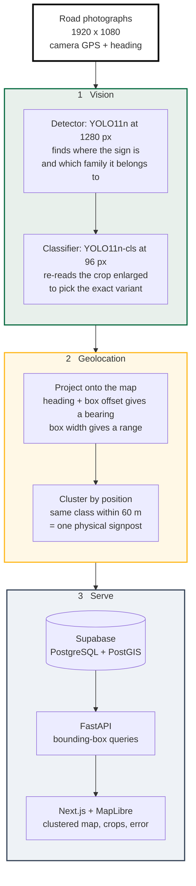

# Traffic Sign Inventory

Turn GPS-tagged road photographs into a searchable map database that aims for one row per physical signpost.


---

## Features

- **Detects road signs** in survey photographs and classifies them into 50 sign types, mostly Manual on Uniform Traffic Control Devices (MUTCD) codes plus a few Vermont catalog codes such as `VR-141` and `WT-100`.
- **Locates each sign**, not the camera. Median error is 4.7 m, against 10.7 m for the raw vehicle GPS.
- **Deduplicates automatically.** A sign photographed 13 times becomes one database row, not 13. The deduplication score on held-out roads is 72.4% (see [Results](#results)).
- **Two-stage classification.** A second model re-reads each crop from a look-alike sign family, lifting accuracy on those families from 78.7% to 94.3%.
- **Stores results in PostGIS**, so map queries like "every sign in this rectangle" run in the database.
- **Ships a dashboard** with a clustered map, per-sign crops, and the measured error wherever ground truth exists.
- **Scores itself.** One command (`scripts/07_batch_evaluate.py`) reproduces the pipeline numbers on held-out sequences; detection mAP comes from the training notebook.

## Tech stack

| Layer | Choice |
|---|---|
| Detection | YOLO11n (Ultralytics), 1280 px |
| Classification | YOLO11n-cls, 96 px crops |
| Backend | FastAPI, Python 3.10+ |
| Database | Supabase — PostgreSQL + PostGIS |
| Frontend | Next.js 14, MapLibre GL, Tailwind CSS |
| Training | Google Colab, free T4 GPU |
| Dataset | ARTSv2 (University of Vermont) |

---

## Quick start

### Prerequisites

- Python 3.10 or newer
- Node.js 18 or newer
- A free [Supabase](https://supabase.com) project
- About 15 GB of free disk space

Trained weights are included in `weights/`, so no training is needed to run the
project. No GPU is needed either.

Photographs are not included. The pipeline needs ARTSv2 frames together with the
`frames_meta.json` that the converter writes, because camera heading is read only
from that file. Export them with the notebook: `demo_sequence.zip` (Phase E4)
unzips into `data/demo_sequence/`, and `sequences.zip` (Phase F) into
`data/sequences/`.

### 1. Install

```bash
python -m venv .venv
.venv/Scripts/python.exe -m pip install -r requirements.txt
npm install --prefix frontend
```

Use `.venv/bin/python` instead on macOS and Linux. Without a GPU, install the CPU
build of PyTorch first to save about 2 GB:

```bash
.venv/Scripts/python.exe -m pip install torch torchvision --index-url https://download.pytorch.org/whl/cpu
```

### 2. Create the database

1. Create a project at [supabase.com](https://supabase.com).
2. Open the SQL Editor and run [`scripts/04_seed_supabase.sql`](scripts/04_seed_supabase.sql).
   This creates the table, the PostGIS functions, and the row-level security
   policy. It is safe to run more than once.
3. Under **Storage**, create two public buckets: `sign-crops` and `sign-frames`.
   Cropped sign images and full frames are uploaded here.
4. Open **Project Settings → API** and copy three values:

   | Value | Where it appears | What it is for |
   |---|---|---|
   | Project URL | top of the page | the address of the database |
   | `service_role` key | under Project API keys | full access, used by the backend only |
   | `anon` key | under Project API keys | public read-only key for browser-side access; not read by the current code |

### 3. Configure

```bash
cp .env.example .env
```

Fill in the three values copied above:

```bash
SUPABASE_URL=https://your-project.supabase.co
SUPABASE_SERVICE_ROLE_KEY=eyJhbGciOi...
SUPABASE_ANON_KEY=eyJhbGciOi...
```

The `service_role` key bypasses row-level security, so it must stay on the
server and must never reach a browser. The `anon` key is the safe one to expose;
it is limited to reading by the policy created in step 2. No code reads it yet:
the dashboard gets its data through the backend.

Every other setting has a working default. See
[Configuration](#configuration) for the full list.

### 4. Verify

```bash
.venv/Scripts/python.exe scripts/00_preflight.py
```

Checks the Python packages, loads the detector and confirms it is not the
80-class COCO model, checks the photographs and the GPS, ground-truth and sign-id
coverage of `frames_meta.json` in `SEQUENCE_DIR`, then calls the live database to
confirm the table, the `signs_in_bbox` function, and both storage buckets. Prints
`READY`, or names exactly what is missing.

### 5. Run

```bash
.venv/Scripts/python.exe scripts/03_run_pipeline.py
```

Then start the two servers, each in its own terminal:

```bash
.venv/Scripts/python.exe -m uvicorn backend.main:app --port 8000
```

```bash
npm run dev --prefix frontend
```

Open **http://localhost:3000**.

---

## Screenshots


Green circles are clusters and split apart when clicked. Gold circles are
individual signs. The side panel summarises whatever is in view and lists
detections with their crops.


Selecting a sign shows its crop, class, confidence, and how many photographs it
came from. A `W1-2` curve sign on US Route 2, seen 13 times and collapsed into
one row, sits **1.3 m from where it actually stands — against 6.2 m if the
vehicle GPS were used directly**.

Every coordinate carries its provenance. Computed positions are labelled
"Triangulated sign position", although each one is projected from a single view
(see [How it works](#how-it-works)). Placeholder coordinates appear as grey pins
with a red label, so demo data can never pass as a real detection.

---

## Results

Pipeline metrics are measured on 18 road sequences from the held-out test split:
646 photographs and 366 signposts. No signpost in this set appears in training.
The projection constants were fitted on 12 other test-split sequences (462
photographs), which are excluded from every number below. Detection mAP is
measured on the whole test split (2,502 photographs).

| Metric | Result |
|---|---|
| Detection (whole test split) | mAP50 **0.723** · mAP50-95 **0.495** |
| Sign classification (detections matched to a labelled sign) | **94.8%** |
| Signposts found | **80.1%** (293 of 366) |
| Position error | **4.7 m** median · 17.2 m at p90 |
| Same, using raw vehicle GPS | 10.7 m |
| Improvement from projection | **56%** |
| Deduplication (defined below) | **72.4%** (52.7% without the crop classifier) |
| Rows in the dashboard | 327, of which 249 match a labelled sign and are scored |

### Two-stage classification

Some sign families are visually identical apart from small text. `M3-1` to `M3-4`
are the same rectangle reading NORTH, SOUTH, EAST, or WEST. `R2-125` to `R2-165`
differ only by the printed number. With the median sign only 26 pixels on its
shorter side, that text is unreadable, so a second model re-reads each crop
enlarged, with its answer restricted to the family the detector already chose.

| Family | Detector | With classifier |
|---|---|---|
| M3 | 50.4% | **94.2%** |
| R2 | 84.3% | **99.1%** |
| M1 | 86.2% | 97.0% |
| M6 | 80.2% | 88.8% |
| R3 | 80.0% | 86.7% |
| D1 | 96.6% | 93.2% |
| **Confusable families** | **78.7%** | **94.3%** |
| All detections | 85.5% | **94.8%** |

Accuracy is measured per detection: every detection in the 18 held-out sequences
whose box overlaps a labelled sign (IoU ≥ 0.3) is checked against that sign's
class. Six of the 11 multi-member families are listed; the pooled row covers all
11 (34 classes).

This also improved the map results, which was not the goal. Clustering groups
detections by class name, so wrong labels were splitting one signpost across
several rows. Correcting the labels cut splitting by more than half and lifted
deduplication from 52.7% to 72.4%.

### How these numbers were measured

**Deduplication is scored per detected signpost.** The score is
(found − fragmented − merged) / found, where *fragmented* counts signposts that
appear in more than one row and *merged* counts rows that contain more than one
signpost. Signposts that were never detected are left out of this score and
reported as recall instead (80.1%). Rows whose anchor view (the widest box)
matches no labelled sign are counted as rows but not scored. A stricter one-to-one score, where a
signpost counts only if it has exactly one row and that row holds nothing else,
exists in `07_batch_evaluate.py`, but only `SWEEP=1` uses it, to pick the
clustering radius on the calibration sequences.

**Cleaned ground truth.** Some dataset entries appear twice under different ids
at identical coordinates, and sign assemblies place several plates on one post
2–3 m apart. Ids of the same class within 2 m are treated as one post, which is
why the count is 366 rather than 451.

**A custom split.** The dataset ships a split in which 86% of test signs also
appear in training — the same signpost, same drive, both sides. Splitting by
geography instead holds out whole stretches of road. These results are therefore
not comparable to published numbers on the official split.

---

## How it works



Three properties of this data rule out the standard approach.

**Signs are small.** The median sign is 26 pixels on its shorter side in a
1920×1080 frame, and 60% are under 32 px. Detecting at the usual 640 px shrinks
that to about 9 px, barely above the network's smallest feature stride of 8 px.
Detection runs at 1280 px.

**The input is stills, not video.** Trackers such as BoT-SORT link objects
between frames by box overlap, but the camera advances about 8 m between
consecutive photographs, so two views of one sign do not overlap at all.

| Association method | Detections given an identity |
|---|---|
| BoT-SORT | 8 / 95 |
| ByteTrack | 7 / 96 |
| **Position clustering** | **95 / 95** |

Position clustering gives every projected detection an identity by construction;
whether those identities are right is what the deduplication score measures.

**GPS records the vehicle, not the sign.** A sign photographed from 40 m away is
40 m from its recorded position.

The pipeline projects instead of tracking. Camera heading plus the box's
horizontal offset gives a bearing; box width gives a rough range; together they
place the sign itself on the map. Repeat sightings then group by location, which
holds no matter how far the vehicle moved between frames. Each row keeps the
position projected from its widest box, normally the closest view; the other
sightings join the row but do not move it. The dashboard labels these positions "Triangulated sign position",
but no triangulation across views takes place.

The camera field of view (80°) and the width-to-range constant (0.88 m) are
fitted from ground-truth coordinates by least squares, using 771 matched
detections across sequences excluded from every reported result. A fit from a
single sequence gave 95°, so fitting across many sequences matters.

`07_batch_evaluate.py` fits these constants at run time and does not store them.
`03_run_pipeline.py` starts from 60° and 0.7 m and, by default (`CALIBRATE=1`),
refits both on the sequence it is processing, using that sequence's own ground
truth. Scoring its output with `06_evaluate_geo_and_dedupe.py` is therefore not
a held-out test, and on unlabelled photographs it keeps the 60° / 0.7 m defaults
unless `HFOV_DEG=80 SIZE_K=0.88` are set.

---

## API

The backend exposes a small read-mostly API on port 8000. The dashboard uses it
for everything; it is also usable directly.

### `GET /health`

Service status, which weights loaded, and whether the database is connected. Use
it to confirm the backend started correctly.

```bash
curl http://localhost:8000/health
```

```json
{"ok": true, "weights": "weights/best.pt", "fine_tuned": true, "supabase": true}
```

### `GET /signs?bbox=minLng,minLat,maxLng,maxLat`

Every sign inside a map rectangle, given as four comma-separated numbers:
west, south, east, north. This is the endpoint the map calls each time it moves.
The rectangle below covers the Burlington area.

```bash
curl "http://localhost:8000/signs?bbox=-73.3,44.4,-73.1,44.6"
```

Each row includes the sign type, confidence, computed position, the URL of its
cropped image, how many photographs it was seen in, and — where ground truth
exists — the true position and the error in metres.

### `GET /signs/{id}`

One full record, by its UUID.

### `GET /stats`

Totals across the whole database: counts by sign type, by position source, and
by road sequence. Useful for a quick check that a pipeline run landed.

```bash
curl http://localhost:8000/stats
```

### `POST /pipeline/run`

Runs the **BoT-SORT tracker baseline** over a folder of photographs and writes
the rows to the database. It does not use projection, position clustering, or
the crop classifier, so each row sits at the camera's GPS position, and BoT-SORT
is the association method the table in [How it works](#how-it-works) shows
failing on this data. Run `scripts/03_run_pipeline.py` for the full pipeline.
The folder must sit inside `data/`, which keeps the endpoint from reading
arbitrary paths on the machine.

```bash
curl -X POST http://localhost:8000/pipeline/run \
  -H "Content-Type: application/json" \
  -d '{"sequence_dir": "data/demo_sequence"}'
```

---

## Configuration

All settings live in `.env`. Only the first three have no default.

| Variable | Default | Purpose |
|---|---|---|
| `SUPABASE_URL` | — | Project URL from Supabase |
| `SUPABASE_SERVICE_ROLE_KEY` | — | Full-access key. Backend only, never sent to a browser |
| `SUPABASE_ANON_KEY` | — | Public read-only key, for browser-side access. Not read by any code yet |
| `WEIGHTS_PATH` | `weights/best.pt` | The detector |
| `CLS_WEIGHTS` | `weights/crop_classifier.pt` | The crop classifier, used by the pipeline scripts but not by the API. Set to `none` to disable the second stage |
| `CLS_MIN_CONF` | `0.8` | How sure the classifier must be before it overrules the detector |
| `CONF` | `0.25` | Minimum detection confidence to keep a box |
| `TRACKER` | `botsort.yaml` | Tracker for the baseline: `ASSOCIATION=tracker` in `03_run_pipeline.py`, and always in `POST /pipeline/run` |
| `FRONTEND_ORIGIN` | `http://localhost:3000` | Allowed origin for browser requests to the API |
| `SEQUENCE_DIR` | `data/demo_sequence` | Which folder of photographs to process |
| `ALLOW_SYNTHETIC_GPS` | `0` | Demo only. When `1`, signs with no GPS get a placeholder position, shown as a grey pin with a red label in the dashboard |
| `ASSOCIATION` | `geometric` | `03_run_pipeline.py` only. `tracker` runs the BoT-SORT baseline instead of projection and clustering |
| `HFOV_DEG`, `SIZE_K` | `60`, `0.7` | Projection constants `03_run_pipeline.py` uses when it does not or cannot calibrate. The held-out fit is 80 and 0.88 |
| `CALIBRATE` | `1` | `03_run_pipeline.py` refits the projection constants on the sequence's own ground truth |
| `RADIUS_M` | `60` | Clustering radius in metres |

The dashboard reads one setting of its own, `NEXT_PUBLIC_API_BASE` (default
`http://localhost:8000`), from `frontend/.env.local`.

The pipeline scripts accept a few more as one-off overrides, listed in
[Reproducing the results](#reproducing-the-results).

---

## Repository structure

```
├── notebooks/
│   ├── 01_train_yolo_colab.ipynb   Colab notebook, phases A–G (no outputs)
│   ├── 01_train_yolo_colab_RUN.ipynb         executed: data audit, training, test mAP
│   └── 01_train_yolo_colab_G1_G2_RUN.ipynb   executed: adds sequence export, crop classifier
├── scripts/
│   ├── 00_preflight.py             checks packages, detector, data, database
│   ├── 01_download_arts_notes.md   dataset source and annotation format
│   ├── 02_convert_arts_to_yolo.py  ARTSv2 → YOLO, geographic split
│   ├── 03_run_pipeline.py          photographs → signs → database
│   ├── 04_seed_supabase.sql        schema, functions, row-level security
│   ├── 06_evaluate_geo_and_dedupe.py   scores one sequence
│   ├── 07_batch_evaluate.py        scores many, with held-out calibration
│   ├── 09a_gps_error_report.py     position error computed inside PostGIS
│   ├── 09c_privacy_blur.py         blurs people in crops (plates/faces need another model)
│   └── 10_screenshots.py           regenerates the images above
├── pipeline_core.py                detection, projection, clustering
├── backend/main.py                 FastAPI service
├── frontend/                       Next.js + MapLibre dashboard
├── weights/                        trained models, tracked in git
├── data/                           photographs and results (not in git)
└── docs/screenshots/
```

---

## Dataset

**ARTSv2 — Automotive Repository of Traffic Signs**, VaiL group, University of
Vermont. Subset `challenging_dom`.

| | |
|---|---|
| Photographs | 19,914 at 1920×1080 |
| Labelled signs | 35,979 across 171 classes |
| Distinct sign ids | 7,773 |
| Coverage | 42.7°N–45.0°N, 73.3°W–71.6°W — the State of Vermont |

Every photograph carries the camera's latitude, longitude, and heading. Every
labelled sign carries its own coordinates and an identifier, which is what makes
position error and deduplication measurable at all.

Download it from the [Google Drive folder](https://drive.google.com/drive/folders/1u_nx38M0_owB0cR-qA6IOWgZhGpb9sWU)
linked from the paper. It arrives already unpacked in PASCAL VOC layout —
`Annotations/`, `JPEGImages/`, `ImageSets/`. Notes on the annotation format,
including the exact XML fields, are in
[`scripts/01_download_arts_notes.md`](scripts/01_download_arts_notes.md).

The repository includes the trained weights but no photographs, so the dataset
is needed to run the pipeline as well as to retrain or reproduce the evaluation.

---

## Training

Both models train on a free Colab T4 using
[`notebooks/01_train_yolo_colab.ipynb`](notebooks/01_train_yolo_colab.ipynb),
phases A–G. The two `_RUN` notebooks are executed copies that hold the training
and test outputs quoted in this README.

| | Detector | Crop classifier |
|---|---|---|
| Architecture | YOLO11n | YOLO11n-cls |
| Parameters | 2.6 M | 1.6 M |
| Input | 1280 px | 96 px |
| Classes | 50 | 34 |
| Size | 5.6 MB | 3.3 MB |
| Training time | ~9 hours | ~15 minutes |

**Detector.** 40 epochs, batch 8, AdamW, early-stopping patience of 12 epochs
(never triggered; all 40 ran). Around
14 minutes per epoch. Free Colab allows a few GPU-hours per day, so checkpoints
write to Google Drive every epoch and a resume cell continues from the exact
epoch a session ended.

**Crop classifier.** 11,232 crops cut from training photographs using
ground-truth boxes with 15% padding, so the framing resembles a predicted box.
Reaches 96.6% top-1 on 2,173 validation crops, which also picked the best epoch,
and 94.3% on detector boxes from look-alike families in the held-out sequences.

Only 50 of 171 classes are trained. The top 50 cover 75% of all labelled signs,
and the rarest of them still has around 200 examples. Below that there is too
little data.

One detail worth knowing before running the notebook: photographs are copied to
Colab's local disk before training. Reading them from Google Drive one at a time
runs at roughly one file per second because each read is a separate network
request. With 32 parallel threads a short benchmark reached about 700 files per
second; the full copy of 40,526 files (8.6 GB) averaged about 44 files per second
and took 15.5 minutes instead of roughly 11 hours.

### Reproducing the results

```bash
.venv/Scripts/python.exe scripts/07_batch_evaluate.py
```

Reads every folder under `data/sequences/`, fits the projection constants on the
first 40% by folder name, applies those constants unchanged to the rest, and
reports pooled scores plus a per-family classification table.

| Override | Effect |
|---|---|
| `SWEEP=1` | Tries several clustering radii, on the calibration sequences only |
| `CLS_WEIGHTS=none` | Disables the crop classifier, to measure its contribution |
| `UPLOAD=1` | Also writes the evaluated sequences to the database |

The BoT-SORT baseline is not part of this script; run it with
`ASSOCIATION=tracker` in `scripts/03_run_pipeline.py`.

Detection results are cached, so repeat runs with different settings are instant.
The report is written to `data/batch_evaluation.json`, which is not in git.

---

## Limitations

- **Splitting is the main weakness.** One signpost still produces several rows
  often enough that the deduplication score is only 72.4% (see
  [Results](#results)). A deployment would need a review step to merge duplicates. Merging distinct
  signs into one row is the rarer error, which is the safer direction.
- **Distance is estimated from apparent size**, assuming signs are roughly
  standard. Direction is far more reliable than range, so most remaining error
  lies along the line of sight.
- **The crop classifier is overconfident when wrong** — 0.89 average confidence
  on mistakes against 1.00 when correct — so confidence is a weak filter. A 0.8
  threshold is applied but cannot do more.
- **121 of 171 classes are unsupported.** Only the 50 most frequent, with 204 or
  more examples each, were trained.
- **Recall is 80% of signposts.** Signs photographed once, or only from a
  distance, are missed most often.
- **The pipeline needs converter output.** Camera heading is read only from the
  `frames_meta.json` written by `02_convert_arts_to_yolo.py`, and EXIF GPS is not
  read, so ordinary geotagged photographs produce no rows.
- **The fitted projection constants are not stored.** On unlabelled photographs
  `03_run_pipeline.py` falls back to 60° and 0.7 m unless they are set by hand.
- **The API endpoint runs the tracker baseline.** `POST /pipeline/run` uses
  BoT-SORT with camera-GPS positions and no crop classifier; only the scripts run
  the full pipeline.


## Credits

### Dataset

ARTSv2 was collected and released by the Vermont Artificial Intelligence Lab (VaiL) at the
University of Vermont. 

> Wilson, D., Alshaabi, T., Van Oort, C., Zhang, X., Nelson, J., & Wshah, S.
> (2022). Object Tracking and Geo-Localization from Street Images.
> *Remote Sensing*, 14(11), 2575. https://doi.org/10.3390/rs14112575

